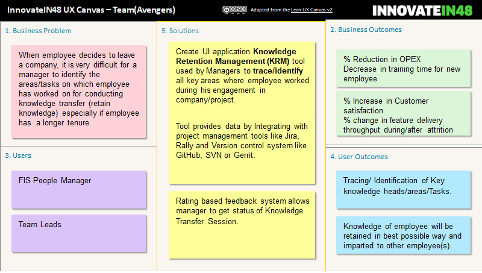

## Knowledge Retention Management tool

###Problem Statement/Solution

#### Background

In the current scenario, organizations are facing lot of challenges not only on technical front but also on the resource management front especially pertaining to Knowledge retention.
High attrition rate (Industry average more than 20%) has made it worse.
When a knowledgeable employee decides to quit/move laterally, he takes away lot of functional and technical knowledge related to the project with him. Even if a new resource with high skill set is hired to backfill, it always takes time for him/her to gain momentum and start contributing.
####Problem Statement
Knowledge retention by way of getting it transferred from resigned/ lateral moved employee is utmost important. The situation becomes critical when we are unable to hire backfill employee during notice period of resigned employee. This creates a gap in overall knowledge of product which is difficult to fill later. When an employee resigns backfills are at mercy of knowledge heads/areas shared by exiting employee and in absence of a structured way to trace knowledge heads it becomes increasingly difficult.

**Tracing/ Identification of Key knowledge heads/areas and Management of the same are the pain points.**

####Solution
Proposed **KRM (Knowledge Retention Management)** tool/app will help in identifying/tracking functional/technical areas of resigned employee and managing knowledge transfer onto new/backfill employee thus effectively helping them in quicker and effective onboarding in project.
It can be decomposed into following and will be implemented in multiple phase:

**•**	**Identifying/Tracking knowledge areas** (automatically from source code repo like GitHub & ALM tool such as Rally/Jira)
**•**	Supplementing with other required tasks/ areas such as domain and technical trainings.
**•**	Management of knowledge task/areas and related knowledge artefacts.
**•**	Governance and transparency in tracking including capability to score knowledge transfer.
**•**	To be hosted on FIS portal-> MyApps with SSO login capabilities same as other apps.

### Canvas

  

