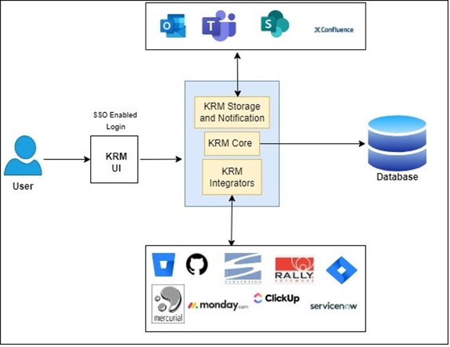

## Knowledge Retention Management tool

###Problem Statement/Solution

#### Background

In the current scenario, organizations are facing lot of challenges not only on technical front but also on the resource management front especially pertaining to Knowledge retention.
High attrition rate (Industry average more than 20%) has made it worse.
When a knowledgeable employee decides to quit/move laterally, he takes away lot of functional and technical knowledge related to the project with him. Even if a new resource with high skill set is hired to backfill, it always takes time for him/her to gain momentum and start contributing.
####Problem Statement
Knowledge retention by way of getting it transferred from resigned/ lateral moved employee is utmost important. The situation becomes critical when we are unable to hire backfill employee during notice period of resigned employee. This creates a gap in overall knowledge of product which is difficult to fill later. When an employee resigns backfills are at mercy of knowledge heads/areas shared by exiting employee and in absence of a structured way to trace knowledge heads it becomes increasingly difficult.

**Tracing/ Identification of Key knowledge heads/areas and Management of the same are the pain points.**

####Solution
Proposed **KRM (Knowledge Retention Management)** tool/app will help in identifying/tracking functional/technical areas of resigned employee and managing knowledge transfer onto new/backfill employee thus effectively helping them in quicker and effective onboarding in project.
It can be decomposed into following and will be implemented in multiple phase:

**•**	**Identifying/Tracking knowledge areas** (automatically from source code repo like GitHub & ALM tool such as Rally/Jira)

**•**	Supplementing with other required tasks/ areas such as domain and technical trainings.

**•**	Management of knowledge task/areas and related knowledge artefacts.

**•**	Governance and transparency in tracking including capability to score knowledge transfer.

**•**	To be hosted on FIS portal-> MyApps with SSO login capabilities same as other apps.

### Canvas

  

### Solution Features
New Application should be access via SSO and is available within
MyApps. 
It can be accessed by Manager, Outgoing Employee and trainee employee.
Below are major features for each Persona:
#### Manager
**•** Get details for employee engagement through various tools consolidated in KRM UI(Knowledge heads tracing)

**•** Able to assign items for Knowledge Transfer to other employees by searching them from KRM UI

**•** Monitor Knowledge transfer progress through KRM system

**•** Able to analyze quality of Knowledge transfer sessions from Ratings from employees

**•** Receives Notifications/Alerts for delays observed in plan

#### Outgoing Employee

**•** Receive Notifications from KRM system for assigned tasks

**•** Automatic Meetings schedules in outlook (Optional)

**•** Need to update  Recording/Documents links of SharePoint/Confluence in KRM System 

#### Trainee Employee
**•** Receive Notifications from KRM system for assigned tasks

**•** Able to Rate Knowledge Transfer session on scale of 1-5

### Technologies and Architecture

Refer below diagram for Architecture:

  

Since this a new application, we can simply proceed with 
monolithic application having Angular for UI, Java for backend and REST API for client-server communication.

Later we can store documents on S3 and deploy application on cloud.

Currently, application is in Angular only calling API for Jira and Github directly to fetch relevant details.

This can be developed later as a layered architecture.

### What your code is designed for
Currently, code is designed for Manager role. 
Manager can logged-in in system and search for an Resigned/Outgoing employee.
System will return all the knowledge heads of searched employee through
 Project and Code management tool used in organisation.

### What your code was written in
Currently code is written in Angular version 13.
REST APIs are used to integrate with Jira and Github.

